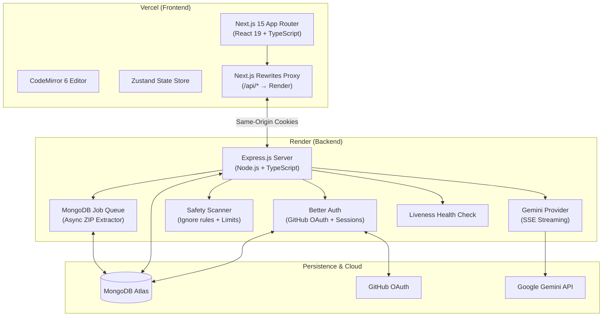

# Study AI — Project-Aware AI Developer Assistant

Study AI is a Phase 1, full-stack project-aware AI assistant for developers and engineering students. It accepts ZIP source projects, safely indexes them, and provides authenticated, project-scoped code explanations with persisted contextual follow-up chat.

---

## 🏗️ Architecture Overview



---

## ✨ Features

- **Project Workspaces**: Upload project `.zip` archives. GitHub repository import is intentionally reserved for a later phase.
- **Async Project Scanner**: Non-blocking background extraction and indexing. Automatically ignores `node_modules`, `.git`, `dist`, `.next`, `venv`, and 40+ build artifact directories.
- **IDE Code Explorer**: High-performance CodeMirror 6 viewer with file tree navigation and code selection.
- **Server-Side Gemini AI**: Streaming AI explanations, selection breakdowns, and persisted architecture overviews using Google Gemini (`gemini-3.6-flash`, configurable through `GEMINI_MODEL`).
- **Durable favourites**: Saved response snapshots remain readable after their ordinary generation or source project is removed.
- **Contextual Chat**: Persisted follow-up discussion linked to its AI generation, project, and user.
- **MongoDB Atlas Persistence**: Durable storage for projects, files, processing jobs, conversations, AI generations, notes, and activity events.
- **Better Auth Integration**: MongoDB-backed GitHub OAuth sessions with same-origin cookie handling via Next.js reverse proxy rewrites.
- **Hardened Liveness Endpoint**: Instant `GET /health` HTTP 200 response for cloud platform liveness probes.

---

## 💻 Local Development Setup

### Prerequisites
- Node.js v18+
- MongoDB instance or MongoDB Atlas cluster URI
- Google Gemini API key from [Google AI Studio](https://aistudio.google.com/)

### 1. Backend Setup

```bash
cd backend
npm install
cp .env.example .env
```

Configure `backend/.env`:
```env
PORT=3001
NODE_ENV=development
FRONTEND_URL=http://localhost:3000
MONGODB_URI=mongodb://localhost:27017/studyai
BETTER_AUTH_SECRET=your_32_character_secret_here
BETTER_AUTH_URL=http://localhost:3000
GEMINI_API_KEY=your_gemini_api_key_here
GEMINI_MODEL=gemini-3.6-flash
```

Start the backend dev server:
```bash
npm run dev
```
Backend runs on `http://localhost:3001`. Verify at `http://localhost:3001/health`.

### 2. Frontend Setup

```bash
cd frontend
npm install
cp .env.example .env.local
```

Configure `frontend/.env.local`:
```env
RENDER_BACKEND_URL=http://localhost:3001
NEXT_PUBLIC_API_URL=/api
```

Start the frontend dev server:
```bash
npm run dev
```
Frontend runs on `http://localhost:3000`. Next.js rewrites automatically proxy `/api/*` to `http://localhost:3001`.

---

## 🚀 Production Deployment

### Backend on Render
1. Create a Web Service on [Render](https://render.com/).
2. Root Directory: `backend`
3. Build Command: `npm install && npm run build`
4. Start Command: `npm start`
5. Set environment variables (`MONGODB_URI`, `GEMINI_API_KEY`, `BETTER_AUTH_SECRET`, etc.).

### Frontend on Vercel
1. Import repository on [Vercel](https://vercel.com/).
2. Framework Preset: Next.js; set Root Directory to `frontend`.
3. Set `RENDER_BACKEND_URL` to your Render backend domain (e.g. `https://study-ai-api.onrender.com`). It is required for production builds. On Render, set both `FRONTEND_URL` and `BETTER_AUTH_URL` to the public Vercel origin so GitHub callbacks flow through `https://your-app.vercel.app/api/auth/*`.

For Better Auth IP-aware rate limiting, set `BETTER_AUTH_TRUSTED_PROXIES` on Render to the exact proxy IP/CIDR entries supplied by the deployment path. The service keeps `trust proxy` at one hop and does not accept arbitrary forwarded IP addresses.

---

## 🔒 Security & Safety Limits

- **Zip Slip Defense**: Prevents directory traversal attacks (`../` or absolute paths in ZIP entries).
- **Scanner Caps**: Configurable file limits (`MAX_SCANNED_FILES=10000`, `MAX_READABLE_FILE_SIZE=512KB`).
- **Binary Filtering**: Skips 30+ binary formats (`png`, `zip`, `exe`, `dll`, etc.).
- **No Untrusted Execution**: Source code is parsed only for text analysis; uploaded code is never executed.
- **Server-Only API Keys**: `GEMINI_API_KEY` is kept strictly server-side.

---

## 📜 License

MIT License.
